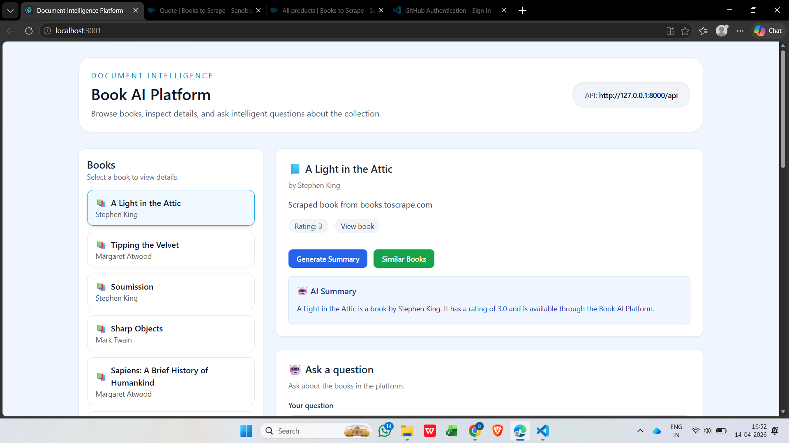
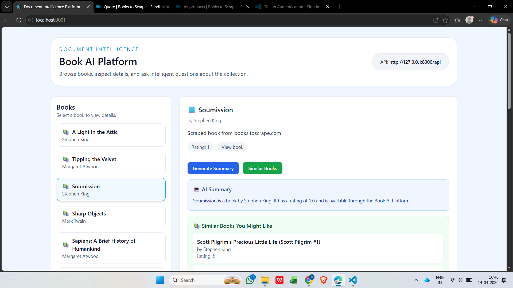
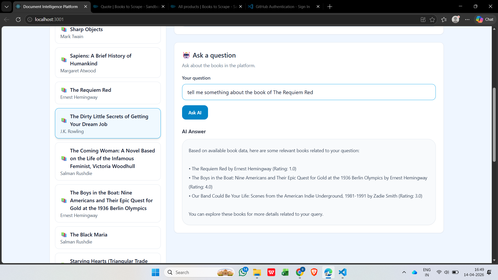

# 📘 Book AI Platform

This is a full-stack web application that uses AI to work with book data.

It collects books using web scraping, stores them in a backend, and shows them in a simple frontend. Users can view book details, generate summaries, ask questions, and get similar book recommendations.

Even if the AI is not available, the system provides useful results using stored data.

## Features

- View books  
- Book details page  
- AI summary  
- Ask questions  
- Similar book recommendations  

## Tech Stack

- Backend: Django REST Framework  
- Frontend: ReactJS + Tailwind CSS  
- Database: SQLite  
- AI: OpenAI API (with fallback)  
- Scraping: BeautifulSoup  

## Screenshots

### Dashboard

### Book Detail

### AI Summary

### Q&A
